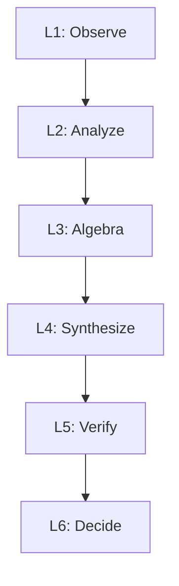

# Diagrams & Visuals

Architecture diagrams, system flowcharts, and visual representations of AXIOM-Ω.

## Purpose

This folder contains visual diagrams and flowcharts that illustrate:

- **System Architecture** — Six-layer design (L1–L6) with data flow
- **Pipeline Flow** — Step-by-step execution from anomaly detection to deployment
- **Mathematical Spaces** — Φ-space, integral bounding, embedding space
- **Swarm Consensus** — Agent voting and decision gates
- **Data Flow** — Vector DB interactions, documentation plane, model memory

## Diagram Categories

### Architecture Diagrams

- `system_layers.svg` *(planned)* — Six-layer stack (L1–L6)
- `component_interaction.svg` *(planned)* — How components communicate
- `documentation_plane.svg` *(planned)* — Vector DB and doc embeddings

### Process Flow

- `pipeline_flow.svg` *(planned)* — End-to-end anomaly → fix → deploy
- `anomaly_detection.svg` *(planned)* — L1–L2 observation and flagging
- `fix_synthesis.svg` *(planned)* — L3–L4 algebra and code decode

### Mathematical Spaces

- `phi_space_visualization.svg` *(planned)* — Φ-space matrix representation
- `integral_bounds.svg` *(planned)* — Triple integral bounding visualization
- `embedding_space.svg` *(planned)* — ANN embedding and decode paths

### Verification & Gating

- `swarm_voter_diagram.svg` *(planned)* — N agents + weighted consensus
- `decision_gate.svg` *(planned)* — YES/NO voting threshold logic
- `feedback_loop.svg` *(planned)* — Retry and learning cycles

## Files

*(To be added as design progresses)*

- `*.svg` — Vector diagrams (scalable, recommended format)
- `*.png` — Raster images (for quick reference)
- `*.mermaid` — Mermaid diagram source files (convertible to SVG/PNG)

## How to Create Diagrams

### Option 1: Mermaid (Recommended for Quick Iteration)

Use Mermaid markdown syntax to create flowcharts and graphs:



### Option 2: SVG (Production Quality)

Use Inkscape, Adobe Illustrator, or web-based tools:
- https://app.diagrams.net/ (free, browser-based)
- Lucidchart
- Draw.io

### Option 3: ASCII Art (Quick Reference)

```
┌─────────────────────────────────────────┐
│  L6: Swarm Decider Node Ω              │
│  [Agent 1] [Agent 2] [Agent 3] → YES/NO│
└────────────────────┬────────────────────┘
                     ↑
┌────────────────────┴────────────────────┐
│  L5: Verification Agents (IDE Layer)    │
│  Test | Doc Check | Semantic Verify     │
└────────────────────┬────────────────────┘
                     ↑
┌────────────────────┴────────────────────┐
│  L4: Code Synthesiser + Decoder         │
│  Solution → Code + Variable Validation  │
└────────────────────┬────────────────────┘
```

## Embedding Diagrams in Documentation

To link diagrams from the main documentation:

1. Save diagram as `diagrams/my_diagram.svg`
2. Reference in HTML or Markdown:
   ```html
   
   ```

## Related Resources

### From Documentation

See [../docs/AXIOM_omega_system_documentation.html](../docs/AXIOM_omega_system_documentation.html) for:
- Detailed descriptions of the six-layer architecture
- Complete pipeline flow explanation
- Mathematical framework visuals

### Design Tools

- **Mermaid Live Editor:** https://mermaid.live
- **Diagrams.net:** https://app.diagrams.net/
- **Excalidraw:** https://excalidraw.com/

---

**Status:** Design phase  
**Version:** v0.1 (PoC)

---

**Contributing:** Add descriptive diagrams with clear labels. Prefer SVG for scalability.